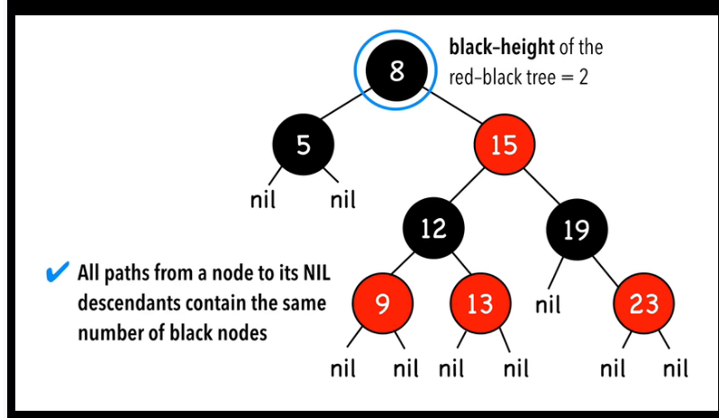
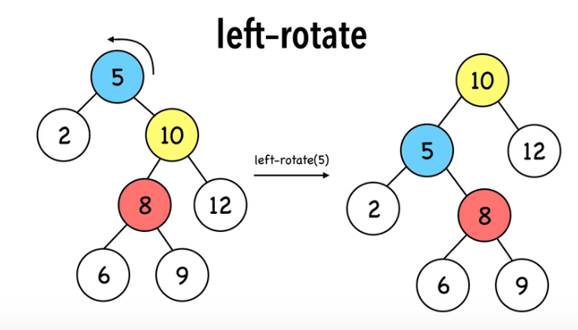
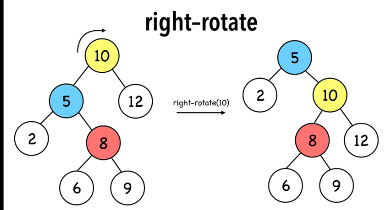
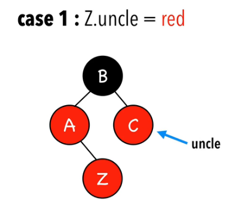
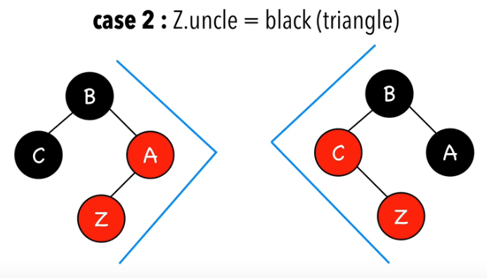
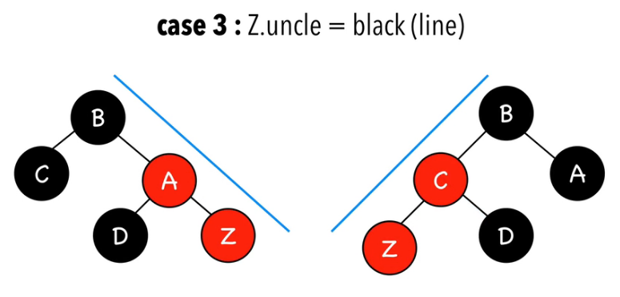

# 红黑树知识点相关

## 红黑树定义和性质
红黑树是一种含有红黑结点并能自平衡的二叉查找树。它必须满足下面性质：

- 性质1：每个节点要么是黑色，要么是红色。
- 性质2：根节点是黑色。
- 性质3：每个叶子节点（NIL）是黑色。
- 性质4：每个红色结点的两个子结点一定都是黑色。（或者是空节点）
- 性质5：任意一结点到每个叶子结点的路径都包含数量相同的黑结点。

就像是这样子：



额外条件：

- 每个节点需要1个额外的标记位来标记颜色
- 最长路（根节点到最远NIL的距离）小于等于最短路（根节点到最近NIL距离）的两倍
  - 最短路=全黑
  - 最长路=半黑半红

## 操作
> 查找；删除；插入；后两者需要旋转的操作
> 三者的复杂度都是O(log_2n)，空间复杂度是O(n) 

### 旋转操作

旋转操作旨在减少树的高度。RBT的树高为O(logN),最小的叶节点永远在最左侧，最大的叶节点永远在最右侧。（这也是查找树的性质）

旋转操作的复杂度都是O(1)

#### L旋转



```c++
void L(node *v){
    node *tmp = v->right;
    v->right = tmp->left;
    tmp->left = v;
    v = tmp;
}
```

#### R旋转



```c++
void R(node *v){
    node *tmp = v->left;
    v->left = t->right;
    tmp->right = v;
    v = tmp;
}
```


不难看出，其实左右旋的操作其实就是平衡二叉树中的L,R旋操作。

### 插入操作
> 啥叫节点的叔叔呢？就是节点父节点的兄弟。

两步操作：

- 按照查找树的规则，插入节点，并将其**着红**
- 做旋转操作，并让颜色保证定义

重点说下第二步。

0. Z = root ->**Z着黑**
1. Z的叔叔是红色->**父亲与叔叔着黑**
2. Z的叔叔是黑色(三角型关系)->**转父节点；方向与三角形尖角方向相同**
3. Z的叔叔是黑色(直线型关系)->重新着色->**转祖先节点，方向与直线方向相反**

#### CASE0：

也就是红黑树为空树的情况，把Z设置为根节点，并将Z涂黑 

#### CASE1：

将Z的爸爸和叔叔涂黑。(A和C涂黑)



#### CASE2:三角型关系

>  Z，Z的父亲，Z的祖父组成三角型。



对于左图（暂且叫它L三角型结构）对Z的父节点进行L旋转。

对于右图（暂且叫它R 三角型结构）对Z的父节点进行R旋转。


#### CASE3:直线型关系



对于左图（暂且叫它R直线结构），将Z的祖父节点着红色，Z的父节点着黑色。对Z的祖父节点进行L旋转。（如下图）

对于右图（暂且叫它L直线结构），将Z的祖父节点着红色，Z的父节点着黑色。对Z的祖父节点进行R旋转。


### 删除操作

> 算了让我先把题给做了。。。

