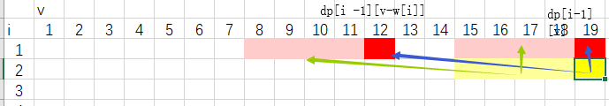
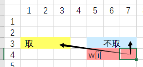
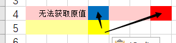
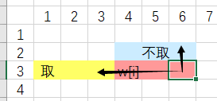
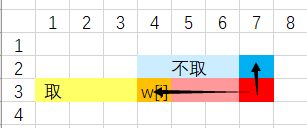

# 动态规划学习（一）

### 数字塔问题

### 最大连续子序列和 BCS

### 最长不下降子序列 LTS

### 最长公共子序列 LCS

### 最长回文子串 LPS

`DP[i][j]` 含义：第i个位置到第j个位置的字符串是否为回文串。
这里的DP是一个上三角矩阵，因为i<=j。

状态转移方程：

$if A[i] != A[j] : DP[i][j] = 0$

$if A[i] == A[j] : DP[i][j] = DP[i-1][j-1]$

初始状态$ DP[i][i] = 1 ; DP[i][i+1] = (A[i] == A[i+1]) ? 1:0$

**关于遍历的问题：**

如果按照正常的顺序，也就是i递增，j递增的顺序，无法保证访问`DP[i][j]`的时候，`DP[i-1][j-1] `已经访问过了.初始的矩阵长这样样子。

初始状态如下：（黄色是指的已经访问过的）

错误的访问方式，比如`dj[4][0] `===> 会查询 `dj[3][1] `这个点。会访问到没有更新过的点。

正确的访问方式，也就是按照字符串的长度每次递增，先长度为3，然后4，以此类推

### DAG 最长路径

### 01背包

第i件物品重量 w[i] 价格c[i] 。背包容量V，问如何选取武平放入背包，使得背包内武平的总价值最大。每件物品1件。

**非优化的情况（二维DP数组）**

`dp[i][j]` 表示前i件物品恰好装入容量为v的背包，所能够获得的最大价值。其中`1 <= i <= n` `0 <= j <= V`
对于每件物品，有取或者不取两种情况，
取：相当于求前i-1件物品恰好装入容量为v-w[i]的背包中所能取得的最大价值
`dp[i][j] = dp[i-1][V - w[i]] + c[i]`
不取：相当于求解前i-1间物品恰好装入容量为v的背包中所能取得的最大价值
`dp[i][j] = dp[i-1][V]`

二维的情况：（19上面应该是`dp[i-1][v])`。可以发现其实当前状态只和上一层的状态相关，于是可以压缩为一维。

**优化的情况（一维DP数组）**

之后，来考虑优化的情况
由于` dp[i][v]` 依赖于 `dp[i-1][v ... w[i]] `的数据，也就是说，第一个维度可以完全省略
于是就有了` dp[v] = max(dp[v],dp[v-w[i]] + c[i])`
但是，一定要逆序遍历v，为啥呢？看如下图。

在遍历v的时候一定要逆序，因为如果顺序会覆盖之前的修改。如下图所示：

此时，按照顺序遍历，遍历到框框所示的位置时候，更新时，所可能的取指，应该为黑色箭头所指的两个dp位置。（粉色的部分代表更新过）

（注意，粉色的部分代表更新过）

如果按照顺序访问，按照图1的情况，是没有问题的。但是当访问到图2的红色位置的时候，就发现。所需要的`dp[i-1][V - w[i]]` 数值一维数组中是`dp[V - w[i]]`（也就是橘色的部分）。但是在之前的更新中，原本`dp[i-1][V - w[i]]`的值可能已经被覆盖掉了，再也访问不到了。

上述两图片就说明了为什么不能顺序访问，其实这个问题和之前LPS的dp更新策略是类似的。而DP中最大的就是想要的答案。

### 完全背包

n件物品，第i件物品的重量为w]i],价值为c[i]。背包容量V，如何选取物品放入背包，使得背包内价值最大。每件物品无穷件。

`dp[i][j]` 表示前i件物品恰好装入容量为v的背包，所能够获得的最大价值。其中`1 <= i <= n` `0 <= j <= V`
对于每件物品，有取或者不取两种情况，
**取**：相当于求前**i**件物品恰好装入容量为v-w[i]的背包中所能取得的最大价值。因为每件物品的数量是无穷件，因此转移的时候物品号(*我们暂且这么称呼它*) 不变。但是容量是会变小的。于是就有了：
`dp[i][j] = dp[i-1][V - w[i]] + c[i]`
**不取**：相当于求解前i-1间物品恰好装入容量为v的背包中所能取得的最大价值（和01背包一样）
`dp[i][j] = dp[i-1][V]`

优化的思路和01背包相似。于是状态装转移方程就如下所示

$dp[v] = max(dp[v] , dp[v-w[i]] +c[i]) \\1\le i \le n, w[i] \le v \le V \\dp[v] = 0 ( 0 \le v \le V)$

但是，利用优化的时候，要注意必须是顺序枚举的，这个和01背包不一样，为什么呢？看看下面的图

此时，按照顺序遍历，遍历到框框所示的位置时候，更新时，所可能的取指，应该为黑色箭头所指的两个dp位置。（粉色的部分代表更新过）

继续遍历，这就遇到了和刚刚01背包相反的情况。在01背包中，我们要访问的是`dp[i-1][V - w[i]]`的值，换个角度理解，就是旧值。而在完全背包中，我们要访问的是``dp[i][V - w[i]]`，也就是新值。而刚刚在01背包中因为被覆盖旧值而导致更新出错的情况恰恰就是在完全背包中我们想要看到的情况。因此，采用的策略就是顺序枚举。

