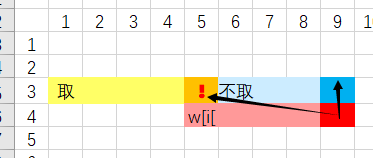

# 动态规划学习（一）

### 数字塔问题

### 最大连续子序列和 BCS

### 最长不下降子序列 LTS

### 最长公共子序列 LCS

### 最长回文子串 LPS

`DP[i][j]` 含义：第i个位置到第j个位置的字符串是否为回文串。
这里的DP是一个上三角矩阵，因为i<=j。

状态转移方程：

if A[i] != A[j] : DP[i][j] = 0

if A[i] == A[j] : DP[i][j] = DP[i-1][j-1]

初始状态 DP[i][i] = 1 ; DP[i][i+1] = (A[i] == A[i+1]) ? 2:1

**关于遍历的问题：**

如果按照正常的顺序，也就是i递增，j递增的顺序，无法保证访问DP[i][j]的时候，DP[i-1][j-1] 已经访问过了.初始的矩阵长这样样子。

初始状态如下：（黄色是指的已经访问过的）

错误的访问方式，比如dj[4][0] ===> 会查询 dj[3][1] 这个点。会访问到没有更新过的点。

正确的访问方式，也就是按照字符串的长度每次递增，先长度为3，然后4，以此类推

### DAG 最长路径

### 01背包

二维的情况：（19上面应该是dp[i-1][v])。可以发现其实当前状态只和上一层的状态相关，于是可以压缩为一维。

一维的情况：（这也说明了一定要逆序逆序！）在遍历v的时候一定要逆序，因为如果顺序会覆盖之前的修改，我们访问的应该是旧的dj值而不是新的。

上述两图片就说明了为什么不能顺序访问，其实这个问题和之前LPS的dp更新策略是类似的。

### 完全背包
